# Introduction
Loxcoder is a Web based application used to visualize and analyse different aspects of a Loxcode. The main purpose of the application is to manipulate and extract meaningful insights from experiment data. This can be easily done by the click of a few buttons. It was created by taking into consideration that the user might not have any coding experience. <br/>
The app can also be used to export your analysis into a report of html or pdf format. This is an end to end solution. <br/>

# Application Installation
- For Ubuntu 20.04.02 or debian user download dependencies using sudo apt-get install from terminal:
    - `sudo apt-get install libcurl4-openssl-dev`
    - `sudo apt-get install libssl-dev`
    - `sudo apt-get install libxml2-dev`
    - `sudo apt-get install libgit2-dev`
    - `sudo aptitude install libgdal-dev`
- For MacOS does not need to do the above installation as it already had those functions.
- open the file loxcoder.Rproj
- open the file server.R from LoxcodeR_app folder
- go to build (next to Environment and History), click "install and Restart" button to install the loxcoder package
- Install the following packages:
    - install.packages(c('devtools','pals','viridis','ggplot2','tidyr','ggbeeswarm','dygraphs','shiny','dplyr','htmlwidgets','digest','bit','flexdashboard','ggthemes','highcharter','scatterD3','comprehenr'))
    - tinytex::install_tinytex()
    - devtools::install_github("rstudio/crosstalk")
    - devtools::install_github("jcheng5/d3scatter")
    - devtools::install_github("hadley/shinySignals")
- Click on RunApp or type runApp('LoxcodeR_app') into the console to run the app

# App Functionality

## Import

The first page of the app is as follows:<br/>

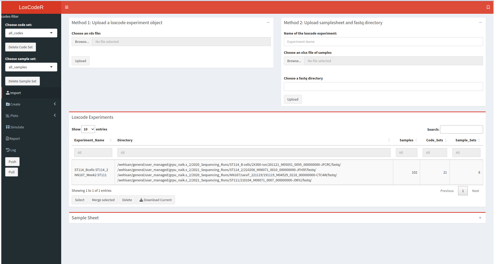<br/>

The left panel is the menu used to access different parts of the application. It also shows the current selected sample set and the code set. This panel is present on all of the application pages.<br/>
The page seen in the above image is the home page. Here we can import new dataset to the app. There are two different ways to do this:<br/>
  1. Using a loxcode experiment object.<br/>
  2. By uploading the raw data in the form of a fastq directory and a sample sheet.<br/>
Once the data has been uploaded We can have a glance at it on the same page by using Sample sheet drop down.<br/>
We can also use the Loxcode Experiments section on the same page to select our desired experiment, Merge multiple experiment dataset, delete a loaded dataset and to download a loaded dataset.<br/>

## Create
### Create Code Sets

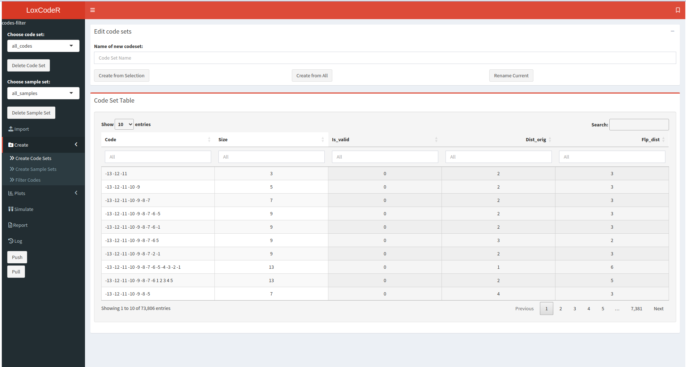<br/>

At the top of this page we have a text box to name a new code set that we create after manipulation. We have 3 options along with this:<br/>

- Create from Selection - This will create a new codeset using only the highlighted codesets from the Code Set Table tab on this page.
- Create from All - This will create a new codeset using all the codesets seen in the Code Set Table tab on this page
- Rename Current - This is used to rename the current selected codeset.<br/>

The Code Set Table section on this page can be used to view and select the codeset we want to use in our sub experiment or visualization. We can do this by either directly selection the rows from the table or by using the filters on top of each column.

### Create Sample Sets

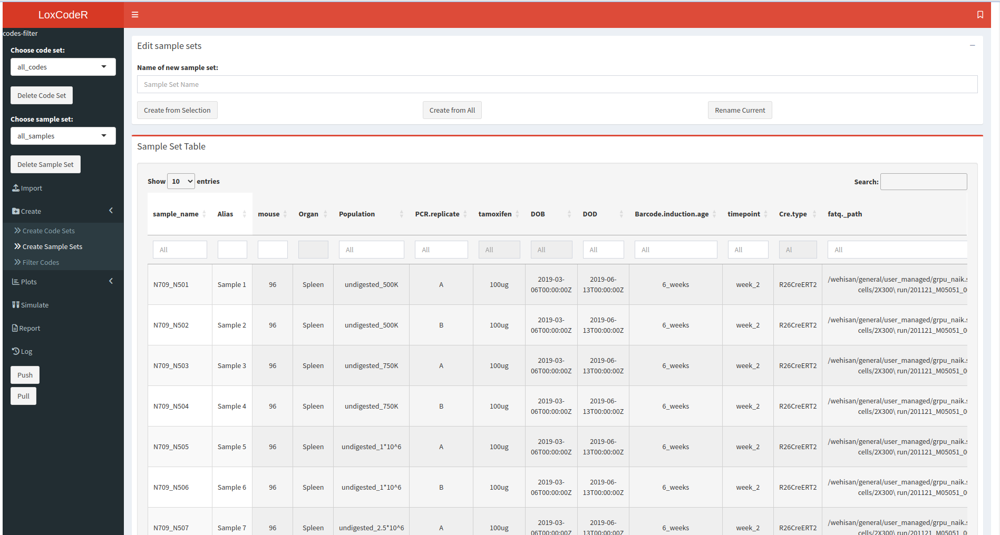<br/>

At the top of this page we have a text box to name a new sample set that we create after manipulation. We have 3 options along with this:<br/>

- Create from Selection - This will create a new sample set using only the highlighted sample sets from the Sample Set Table tab on this page.
- Create from All - This will create a new sample set using all the sample sets seen in the Sample Set Table tab on this page
- Rename Current - This is used to rename the current selected sample set<br/>

The Sample Set Table section on this page can be used to view and select the sample set we want to use in our sub experiment or visualization. We can do this by either directly selection the rows from the table or by using the filters on top of each column.<br/>

We can also use the dropdown options of Collapse samples to collapse our sample set on a particular column. When it is collapsed on PCR Replicate it looks like this:<br/>

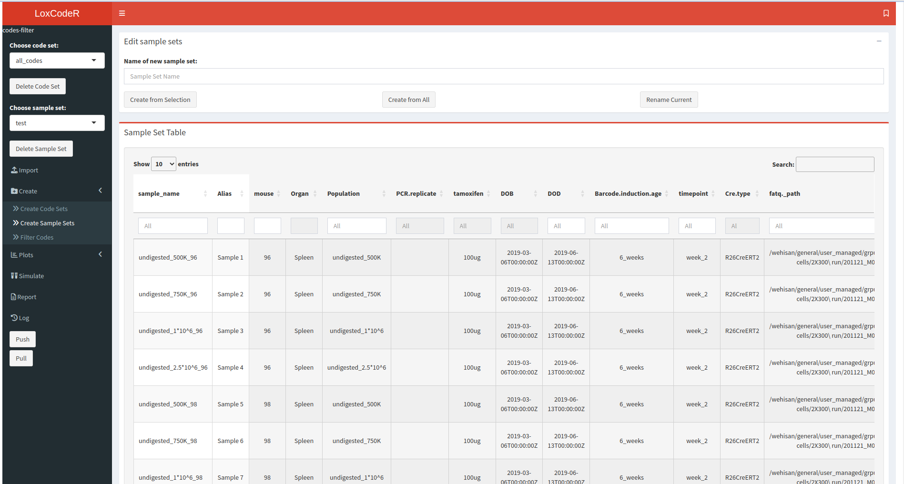<br/>

We can use the Generate alias drop down to create a new alias using some of the columns of our data. Sample output of aliasing on PCR.replicate looks like this<br/>

<br/>

### Filter Codes

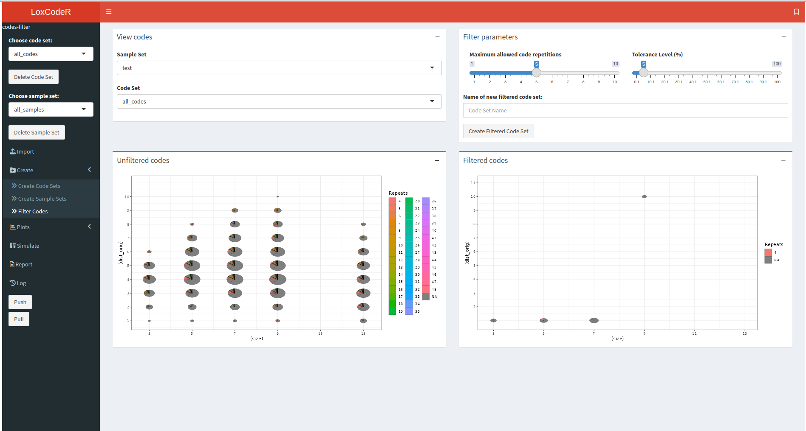<br/>

On this page we can filter our codeset based on loxcode repetition and tolerance level. We can use this to generate the filtered and unfiltered codes. This can also be used to generate new codesets.

## Plots

### Statistics Plots

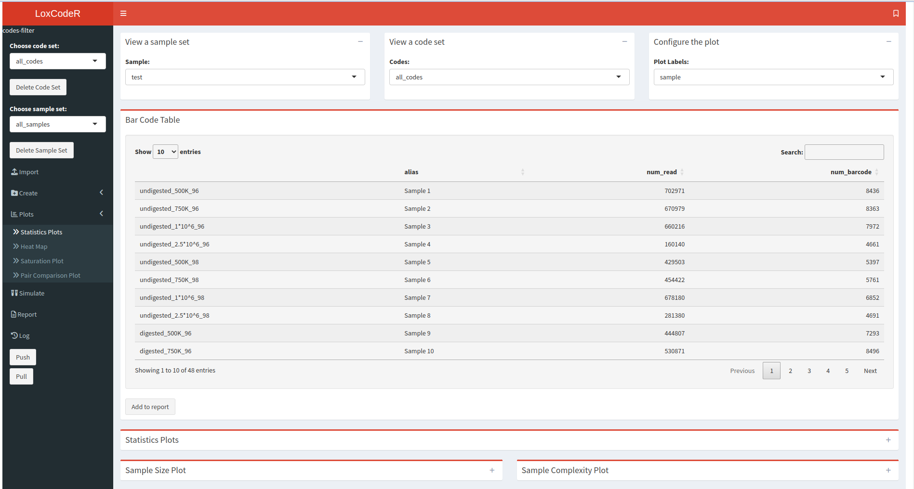<br/>

The top part of this page shows the selected sampleset and codeset along with an option to change plot label to alias if we have created aliases. The Bar Code Table section shows general information about the samples such as the sample name, alias, number of reads of each sample and number of barcodes in each samples. This is mainly the data used in the plots created on this page.

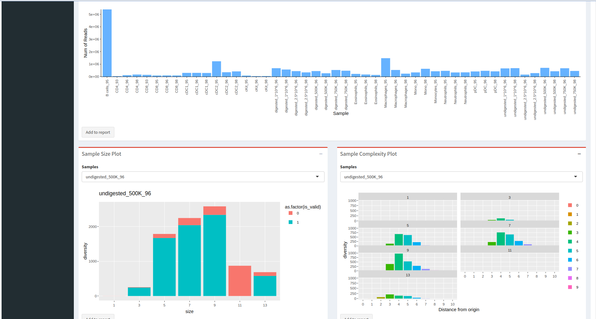<br/>

The second part of this page creates plots. The Statistics Plots dropdown, plots some basic plots which give a high level overview of the dataset. Each of the graphs have an Add to report button which can be used to add the graph seen on page to our final export report.<br/>

Different plots under this sections are:

- Reads <br/>
  This plot shows the number of read for each sample in the experiment.
  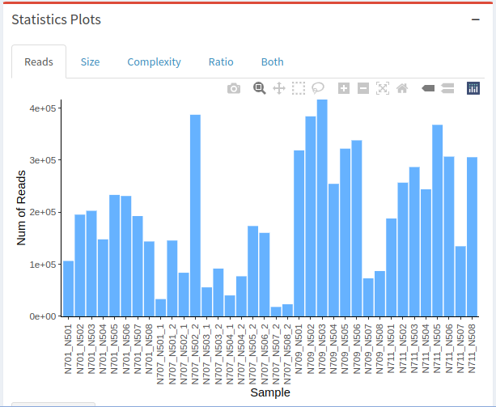<br/>
  
- Size <br/>
  This plot compares the count of distance from origin for each sample in the experiment.
  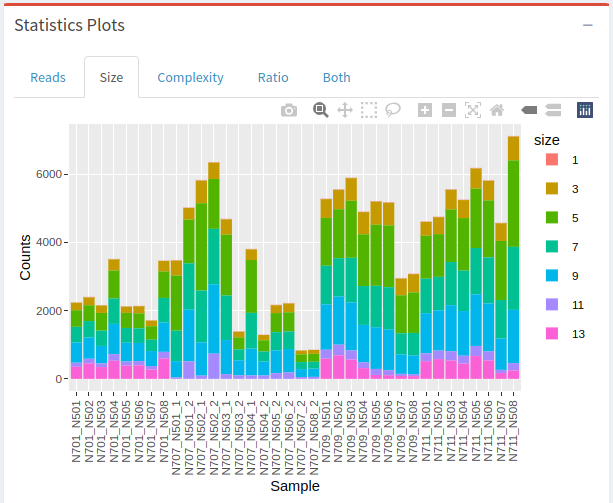<br/>
  
- Complexity Plot
  This plot compares the count of distance from origin for each sample in the experiment.
  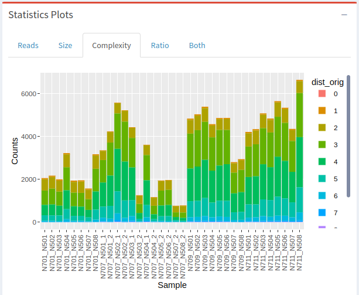<br/>
  
- Ratio Plot
  This plots the ratio of complexity to size for each sample in the experiment.
  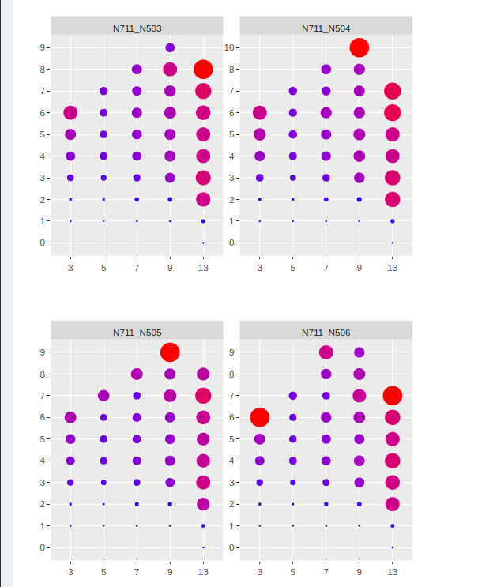<br/>

- Both Plot
  This plot compares the complexity and size based on the number of reads for each sample in the experiment.
  
- Sample Size Plot
  This plots diversity of valid and invalid loxcode for each size in 1 sample.
  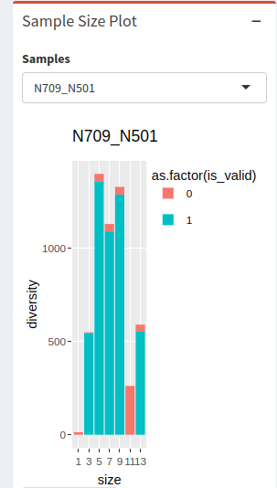<br/>
  
- Sample Complexity Plot 
  This plots the diversity of complexity versus the distance from origin for each size loxcode in 1 sample.
  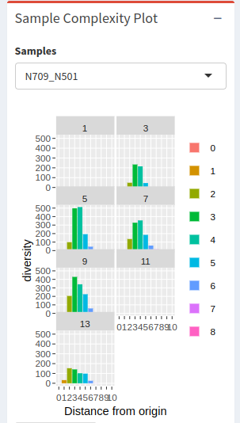<br/>
  
### Heat Map

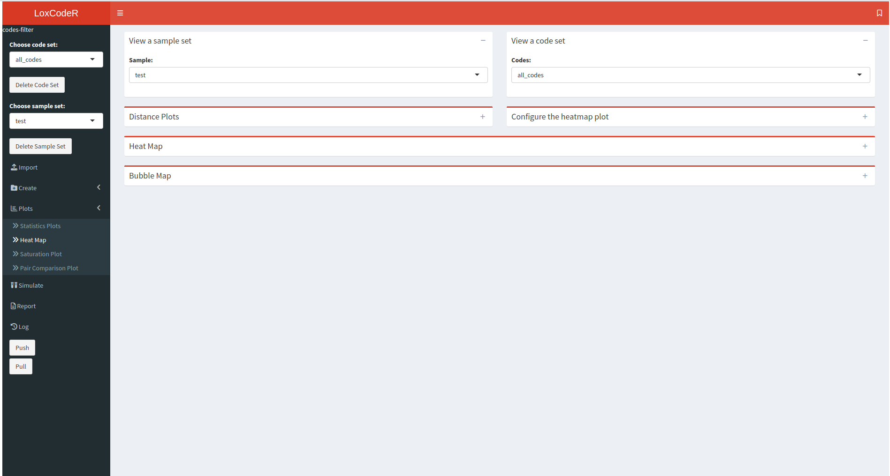<br/>

The top part of this page shows us the sample set and the code set selected currently. The drop down menu in this section can be used to select a different sample and code set.<br/>

We also see a collapsabble section called Distance plot.

Next section on this page is the collapsible Configuration tab. This tab can be used to perform modification to the heatmap and bubble plot. Most of the options in this tab has selection based inputs for easier use of the functionality. All options have a defaut selection so that a general plot can made quickly. We can even split the plots on a specific parameter here.<br/>

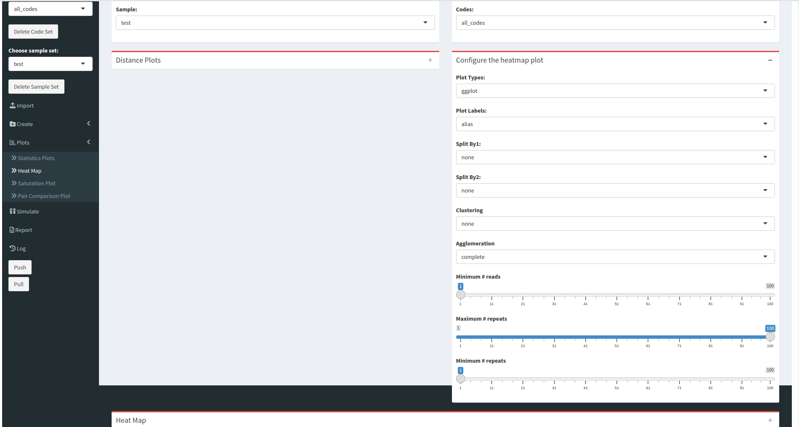<br/>

The Heatmap and Bubble plot collapsible tabs are used to create the respective plots. They also have a option to add them to the report. 
    
- Heat Map
  This plots a heatmap of each sample in the experiment for the log of loxcode count. This plot can be split by 2 factorts by configuring the heatmap.
  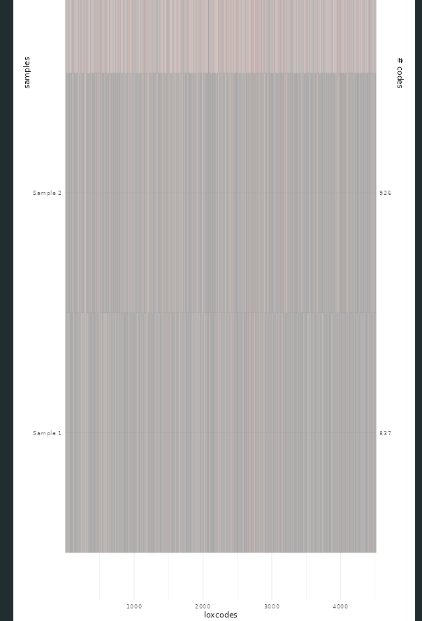<br/>

- Bubble Map
  This plots a bubbple plot of each sample in the experiment for the log of loxcode count. This plot can be split by 2 factorts by configuring the heatmap.
  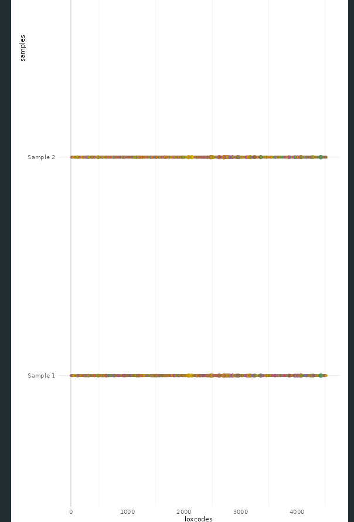<br/>

### Saturation Plot

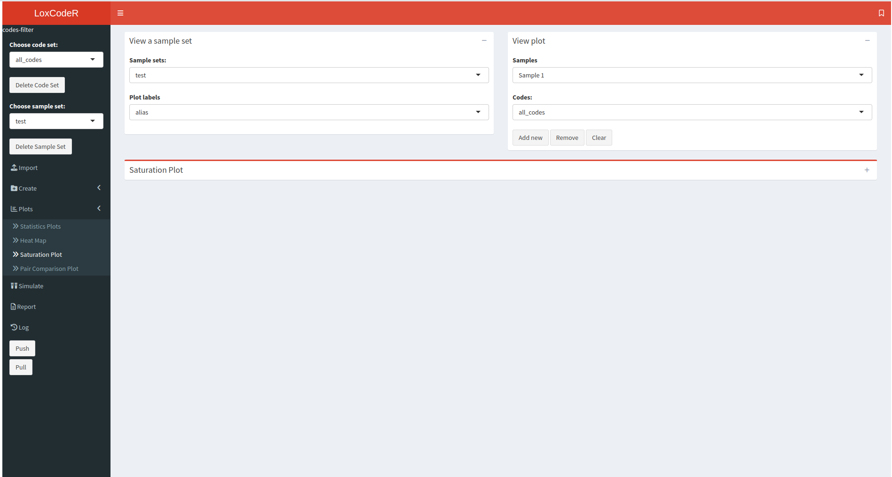<br/>

In the first section, we can view an select sample set on this page. Here we are also given the option to select weather we want samples or alias as the plot label used in plotting. In the View plot tab, We can select the sample we would like to use for creating the plot along with the codesets to be used. Once we have made our selections, we can add a plot for this selection to our space. We can add multiple plots and they will all be plotted in the next section.

- Saturation Plot

  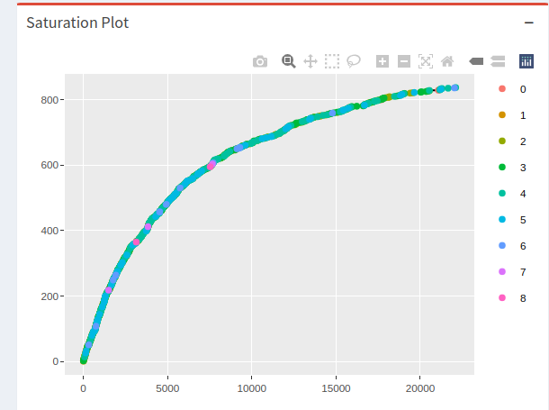<br/>

### Pair Comparision Plot

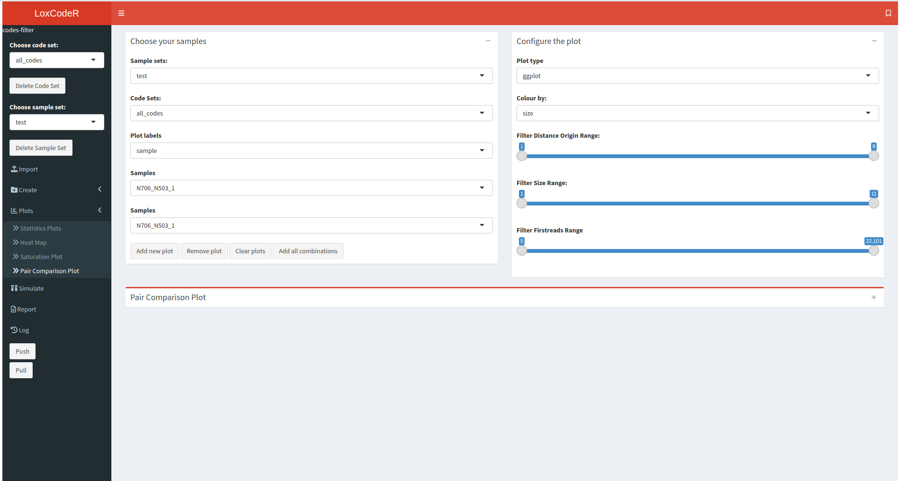<br/>

The first tab on this page can be used to view and select sample set and codeset to be used in our plot. Along with this we can also select our plot labels (sample or alias). Next we can select the samples we want to plot against each other. Once we have made our selections we can go ahead and add these to our plot. Here we are also given an option to add all combinations. This will add every possible combination to our plot.<br/>

We can use the Configure plot tab to make some adjustments in the plot as well. Using this tab we can select The plot type we want, The colour of the plot to be organised based on a specific parameter and we can filter our data on a few parameters.

Next we have the pair Comparision tab<br/>
- Pair Comparision Plot
    It compares 2 samples based on the distribution size or distance from origin or firstread.
    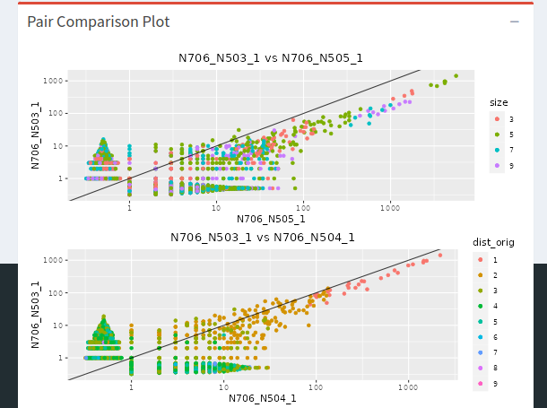<br/>
    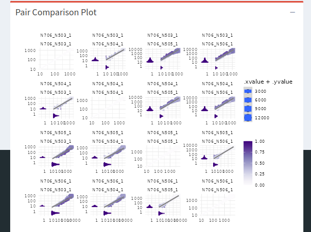<br/>


## Report

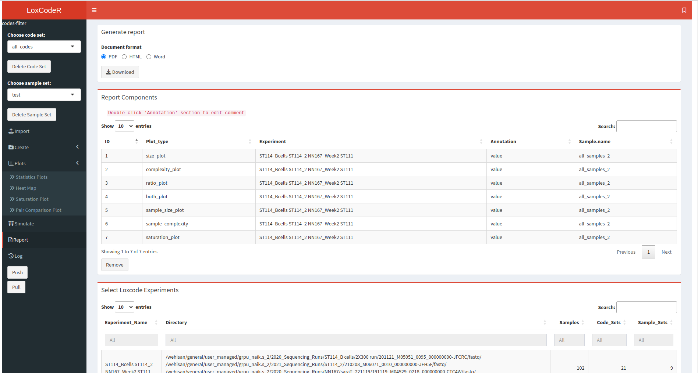<br/>

We can export all our plots and data as a report using this tab. The Generate report section gives us the option to export in form of pdf, HTML and also Word.<br/>
The report components section shows us the Plots that have been added to our report. We can see some plots get added by default in the report. These are some general plots used to describe the data. If we want to remove any of the plots we can select it and click on the remove button in the same section.

<br/>

The next section on the page shows us the Loxcode Experiment that have been loaded into the app and the current experiment. In this section we can select a different experiment if we want. 

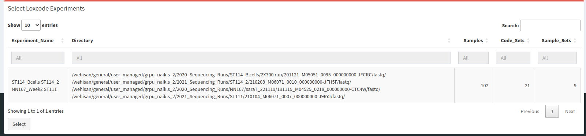<br/>

The next section shows us the codeset and sample set that are currently selected for instant Report component addition. We can select the code set and sample set we want using the drop down selections.

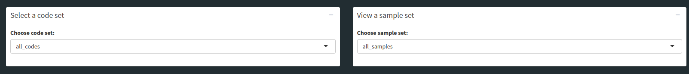<br/>

The last section on this page is the Report Component Section. This section can be used to instantly add graphs to the app. We can just select the graphs we want and they will be added.

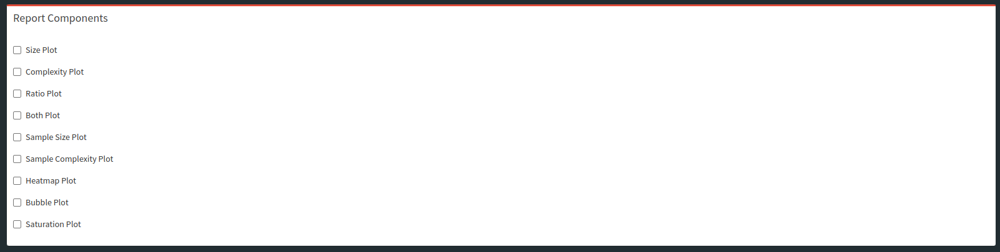<br/>


## Data Migration

The app also provides us a way to switch between console and app data by the click of a button. On the left tab there are 2 buttons labeled Push and Pull. They can be used to save data to a temp file on the system which can be used in the console and to read the modified temp file back into the system respectively. 

<br/>

This migration tool was designed for people who want advanced control over the data which can be provided only in the console. Once the user is done working with the data, they can upload to the same file using the function <function>.

<br/>


# Report

The report comes in 3 forms - HTML, PDF and Word. Html report is the most descriptive report. This has multiple components which explain the data and show the overview of the graphs generated by user.

## Main Page

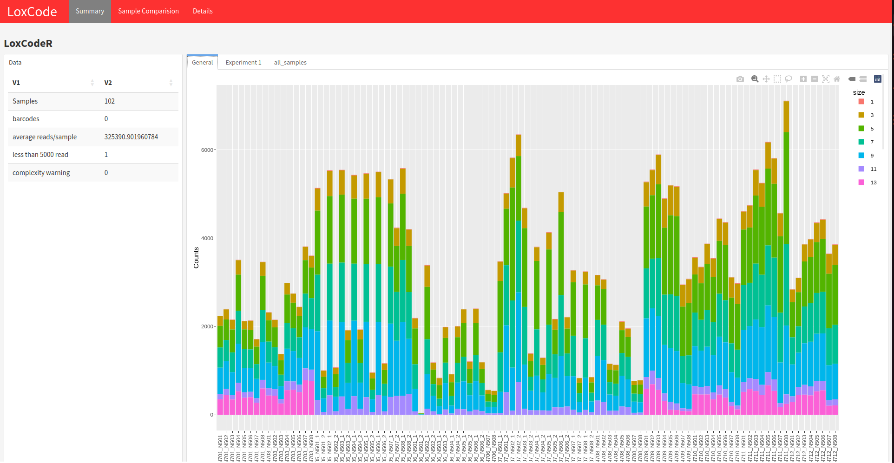<br/>

The main page, also called the Summary page, gives us the overview of the data along with some graphs. The sub tab called general provides us with 5 graphs which explain the experiment data as a whole.<br/>

Within the app the user can also generate graphs for more specific sub experiments. These graphs when added to report can be seen under their respective sample name sub tab on this page.

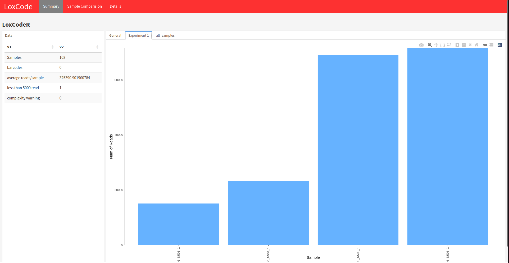<br/>

A user can have as many sub experiments as he wants.

## Sample Comparision Page

This page shows ratio plot and both plot for each sample in the experiment.

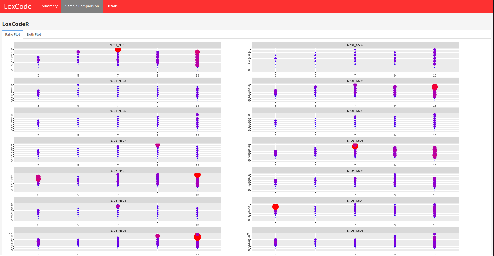<br/>

## Details Page

This page is used to show the experiment data used for the experiment. It also shows us the custom sub experiment data.

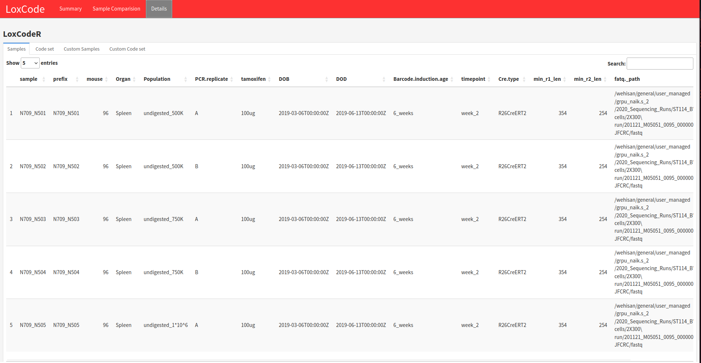<br/>

# Session Info
```{r session_info, echo=FALSE}
sessionInfo()
```

